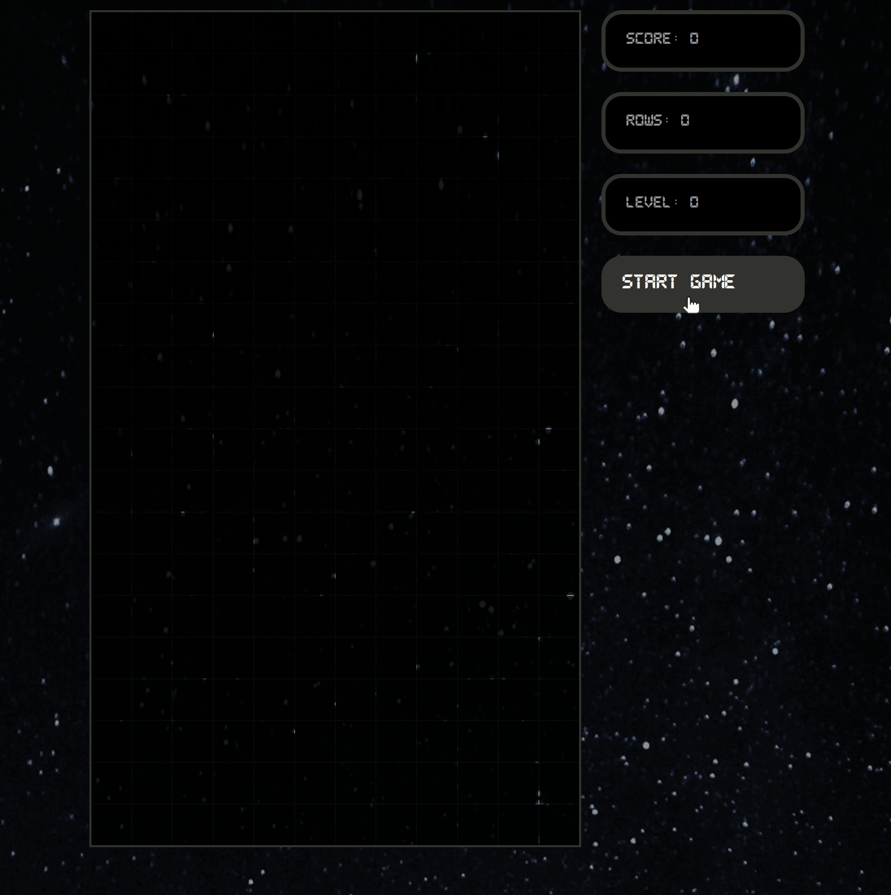
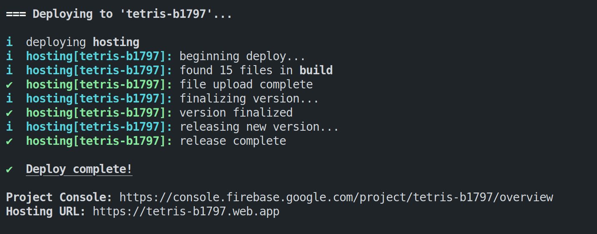

# TETRIS 🕹️

This project was bootstrapped with [Create React App](https://github.com/facebook/create-react-app).

> This project was based on a youtube tutorial: <https://www.youtube.com/watch?v=ZGOaCxX8HIU&t=3057s&ab_channel=freeCodeCamp.org>
> I made some updates on top of it like using typescript, adding linters, tests, etc.

Icon used for the app:
<a href="https://www.flaticon.com/free-icons/shapes" title="shapes icons">
Shapes icons created by Smashicons - Flaticon</a>

This project is hosted in firebase, and you can enjoy a live version by clicking [here](https://tetris-b1797.web.app/).



## Game controls

Use the directional keys from your keyboard to pay the game.

Command | Action
------- | ------
⬆️| rotate the tetromino
⬅️ | move the tetromino to the left
➡️ | move the teromino to the right
⬇️ | move the tetromino down

## Setup ⚒️

1. Clone this repo.
2. Install dependencies (yarn install).
3. run: yarn start

### Available yarn scripts

For starting development server:

```bash
yarn start
```

For running all the tests:

```bash
yarn test
```

For building the app (before deployment):

```bash
yarn build
```

## Deploy a new version of the app ☁️

For deploying a new version of the application proceed as follow:

1. Navigate to the scripts folder.
2. Make sure to have installed [firebase-cli](https://firebase.google.com/docs/cli).
3. execute in the terminal the **`deploy.sh`** script.

